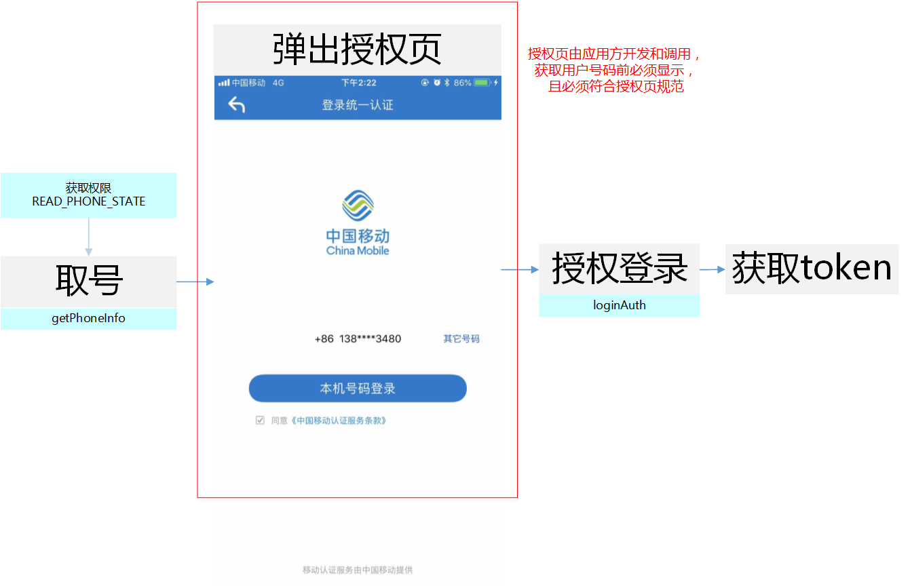

# 1. 开发环境配置
sdk技术问题沟通QQ群：609994083</br>

**注：SDK在获取token过程中，用户手机必须在打开数据网络情况下才能成功，纯wifi环境下建议开发者跳过本SDK逻辑，直接跳到开发者应用原有的登录逻辑**
## 1.1. 总体使用流程

1. 调用SDK方法来获得`token`，步骤如下：

    a. 构造SDK中认证工具类`AuthnHelper`的对象；</br>

    b. 调用SDK取号方法`getPhoneInfo`；</br>

    c. 应用根据**授权页规范**，生成并弹出授权页面展示给用户；

    d. 用户在授权页面点击授权后，应用侧调用SDK授权登录方法`loginAuth`并传入授权页面activity，应用获取取号凭证token。</br>

2. 在业务服务端调用`获取用户信息接口`或`本机号码校验接口`获取相关用户信息</br>

## 1.2. 导入SDK的jar文件

1. 将`quick_login_android_**.jar`拷贝到应用工程的libs目录下，如没有该目录，可新建；
2. 将sdk所需要的证书文件`clientCert.crt`、`serverPublicKey.pem`从提供的demo工程拷贝到项目`assets`目录下。

</br>

## 1.3. 配置AndroidManifest

注意：为避免出错，请直接从Demo中复制带<!-- required -->标签的代码

**1. 配置权限**

```java
<uses-permission android:name="android.permission.INTERNET" />
<uses-permission android:name="android.permission.READ_PHONE_STATE" />
<uses-permission android:name="android.permission.ACCESS_WIFI_STATE" />
<uses-permission android:name="android.permission.ACCESS_NETWORK_STATE" />
<uses-permission android:name="android.permission.CHANGE_NETWORK_STATE" />
<uses-permission android:name="android.permission.WRITE_SETTINGS"/>
<uses-permission android:name="android.permission.GET_TASKS"/>
```

通过以上步骤，工程就已经配置完成了。接下来就可以在代码里使用统一认证的SDK进行开发了

**注意：在调用`取号`或`授权登录`方法时，需提前申请`READ_PHONE_STATE`，否则会报错**

</br>

## 1.4. SDK使用步骤时

**1. 创建一个AuthnHelper实例** 

`AuthnHelper`是SDK的功能入口，所有的接口调用都得通过AuthnHelper进行调用。因此，调用SDK，首先需要创建一个AuthnHelper实例，其代码如下：

```java
public void onCreate(Bundle savedInstanceState) {
    super.onCreate(savedInstanceState);
    mContext = this;    
    ……
    mAuthnHelper = AuthnHelper.getInstance(mContext);
    }
```

**2. 实现回调**

所有的SDK接口调用，都会传入一个回调，用以接收SDK返回的调用结果。结果以`JsonObjent`的形式传递，`TokenListener`的实现示例代码如下：

```java
mListener = new TokenListener() {
    @Override
    public void onGetTokenComplete(JSONObject jObj) {
        if (jObj != null) {
            mResultString = jObj.toString();
            mHandler.sendEmptyMessage(RESULT);
            if (jObj.has("token")) {
                mtoken = jObj.optString("token");
            }
        }
    }
};
```

**3. 接口调用**

```java
loginAuth(final Activity activity, final String appId, final String appKey, final TokenListener listener)
```

```java
public void getPhoneInfo(final String appId, final String appKey, final TokenListener listener)
```

<div STYLE="page-break-after: always;"></div>

# 2. SDK方法说明

## 2.1. 获取管理类的实例对象

### 2.1.1. 方法描述

获取管理类的实例对象

</br>

**原型**

```java
public static AuthnHelper getInstance(Context context)
```

</br>

### 2.1.2. 参数说明

| 参数      | 类型      | 说明                              |
| ------- | ------- | ------------------------------- |
| context | Context | 调用者的上下文环境，其中activity中this即可以代表。 |

</br>

## 2.2. 取号

### 2.2.1. 方法描述

**功能**

本方法用于发起取号请求，并返回用户当前网络环境是否具备取号条件的结果。SDK将在后台完成网络判断、数据网络切换等内部操作并向网关请求申请获取用户本机号码。取号请求成功后，开发者就可以调用并弹出由开发者自定义布局的授权页面。**注意：取号请求前，开发者需提前申请`READ_PHONE_STATE`权限，否则取号会失败！**

**调用建议**

建议开发者在应用开启时调用本方法，有助于提升登录的成功率和用户登录体验。

</br>

**原型**

```java
public void getPhoneInfo(final String appId, 
                         final String appKey, 
                         final TokenListener listener)
```

</br>

### 2.2.2. 参数说明

**请求参数**

| 参数       | 类型            | 说明                                       |
| :------- | :------------ | :--------------------------------------- |
| appId    | String        | 应用的AppID                                 |
| appkey   | String        | 应用密钥                                     |
| listener | TokenListener | TokenListener为回调监听器，是一个java接口，需要调用者自己实现；TokenListener是接口中的认证登录token回调接口，OnGetTokenComplete是该接口中唯一的抽象方法，即void OnGetTokenComplete(JSONObject  jsonobj) |

</br>

**响应参数**

OnGetTokenComplete的参数JSONObject，含义如下：

| 字段          | 类型   | 含义                                                  |
| ------------- | ------ | ----------------------------------------------------- |
| resultCode    | String | 接口返回码，“103000”为成功。具体返回码见4.1 SDK返回码 |
| desc          | String | 成功标识，true为成功。                                |
| securityPhone | String | 手机号码掩码，如“138XXXX0000”                         |

</br>

### 2.2.3. 示例

**请求示例代码**

```java
/***
判断和获取READ_PHONE_STATE权限逻辑
***/   

//创建AuthnHelper实例
public void onCreate(Bundle savedInstanceState) {
    super.onCreate(savedInstanceState);
    mContext = this;    
    ……
    mAuthnHelper = AuthnHelper.getInstance(mContext);
    }

//实现取号回调
mListener = new TokenListener() {
    @Override
    public void onGetTokenComplete(JSONObject jObj) {
        …………	// 应用接收到回调后的处理逻辑
    }
};

//调用取号方法
mAuthnHelper.getPhoneInfo(APP_ID, APP_KEY, mListener);
```

**响应示例代码**

```
{
	"resultCode":"103000",
	"desc":"true",
	"securityPhone:"138XXXX0000"
}
```

## 2.3. 授权登录

### 2.3.1. 方法描述

**功能**

在应用弹出授权页的情况下，调用本方法可以成功获取取号凭证token。如果开发者需要**获取用户完整的手机号码**，调用该方法时，需要将正在运行的授权页面activity传入并获取相对应的token；如果开发者需要做**本机号码校验**，调用该方法时，activity参数传null即可。

</br>

**原型**

```java
public void loginAuth(final Activity activity, 
                      final String appId, 
                      final String appKey, 
                      final TokenListener listener)
```

</br>

### 2.3.2. 参数说明

**请求参数**

| 参数     | 类型          | 说明                                          |
| :------- | :------------ | :-------------------------------------------- |
| appId    | String        | 应用的AppID                                   |
| appkey   | String        | 应用密钥                                      |
| activity | Activity      | 授权页面，由开发者完成页面的设计布局。**当activity传值为null时，将不弹出授权页，登录方式为隐式登录** |
| listener | TokenListener | 认证回调接口，需要调用者自己实现 |

</br>

**响应参数**

TokenListener的参数JSONObject，含义如下：

| 字段        | 类型   | 含义                                                         |
| ----------- | ------ | ------------------------------------------------------------ |
| resultCode  | String | 接口返回码，“103000”为成功。具体响应码见4.1 SDK返回码        |
| authType    | String | 登录方式：1：WIFI下网关鉴权</br>2：网关鉴权</br>3：其他      |
| authTypeDes | String | 登录方式描述                                                 |
| token       | String | 成功时返回：临时凭证，token有效期2min，一次有效；同一用户（手机号）10分钟内获取token且未使用的数量不超过30个 |
| openId      | String | 成功时返回：用户身份唯一标识。（activity传入null时，不返回） |

</br>

### 2.3.3. 示例

**请求示例代码**

```java
// 在调用取号方法getPhoneInfo并返回正确成功时，可以提前知道网络是否可取号并获取到手机号掩码；
// 在弹出授权页前不调用getPhoneInfo方法，无法获取手机号掩码，用户点击授权登录可能会失败


//创建AuthnHelper实例
public void onCreate(Bundle savedInstanceState) {
    super.onCreate(savedInstanceState);
    mContext = this;    
    ……
    mAuthnHelper = AuthnHelper.getInstance(mContext);
    }

//实现回调
mListener = new TokenListener() {
    @Override
    public void onGetTokenComplete(JSONObject jObj) {
        …………	// 应用接收到回调后的处理逻辑
    }
};

/***
1. 应用构造activity页面逻辑
2. 应用弹出授权页面activity逻辑
***/

//用户点击授权按钮时，调用loginAuth方法，获取token
private void Login() {
    
/***
（调用loginAuth方法前，如果还未获取到READ_PHONE_STATE权限，需提前申请）
判断和获取READ_PHONE_STATE权限逻辑
***/   
        
//调用授权登录，传入应用定义的activity（授权页面） 
    mAuthnHelper.loginAuth(activity, Constant.APP_ID, Constant.APP_KEY, mListener);
    ……
}
```

**响应示例代码**

```
{
	"resultCode": "103000",
	"authType": "0",
	"authTypeDes": "其他",
	"token": "STsid0000001526349949452XU2gWQFcgWnoMmwwbK7ijolJcsQsH1Ws",
	“openId":""
}
```

</br>

## 2.4. 隐式登录

### 2.4.1. 方法描述

本SDK不再单独提供隐式登录方法，开发者如果需要使用本SDK实现隐式登录做本机号码校验，在调用显式登录方法时，将activity对象传入值设为null即可，具体可参考下述代码来实现：

```java
//创建AuthnHelper实例
public void onCreate(Bundle savedInstanceState) {
    super.onCreate(savedInstanceState);
    mContext = this;    
    ……
    mAuthnHelper = AuthnHelper.getInstance(mContext);
}

//实现回调
mListener = new TokenListener() {
    @Override
    public void onGetTokenComplete(JSONObject jObj) {
        …………		// 应用接收到回调后的处理逻辑
    }
};

//实现隐式登录获取token
private void implicitLogin() {

    
    
//调用授权登录，activity传null    
    mAuthnHelper.loginAuth(null, Constant.APP_ID, Constant.APP_KEY, mListener);
    ……
}
```


## 2.5. 设置取号超时

###2.5.1. 方法描述

设置取号超时时间，默认为8秒，适用于取号和隐式登录阶段。建议配置值2~4秒

**原型**

```java
public void setTimeOut(long timeOut)
```

###2.5.2. 参数说明

**请求参数**

| 参数    | 类型 | 说明                       |
| ------- | ---- | -------------------------- |
| timeOut | long | 设置超时时间（单位：毫秒） |

**响应参数**

无


## 2.6. 获取网络状态和运营商类型

### 2.6.1. 方法描述

本方法用于获取用户当前的网络环境和运营商

**原型**

```java
public void getNetworkType(Context context,
                           TokenListener listener)
```

### 2.6.2. 参数说明

**请求参数**

| 参数     | 类型          | 说明       |
| -------- | ------------- | ---------- |
| context  | Context       | 上下文对象 |
| listener | TokenListener | 回调       |

**响应参数**

TokenListener的参数JSONObject，含义如下：

| 参数     | 类型   | 说明                                                         |
| -------- | ------ | ------------------------------------------------------------ |
| operator | String | 运营商类型：</br> 1.移动流量；</br>2.联通流量网络；</br>3.电信流量网络。 |
| netType  | String | 网络类型：</br> 0未知；</br>1流量；</br> 2 wifi</br>；3 数据流量+wifi |

### 2.6.3. 示例

```java
mAuthnHelper.getNetworkType (context, new TokenListener() {
    @Override
	public void onGetTokenComplete(JSONObject jsonobj) {
	        // do something
    }
}
);
```


## 2.7. Debug开关

### 2.7.1. 方法描述

用户打开debug日志开关，默认为关闭状态

**原型**

```java
public void setDebugMode(boolean isDebug)
```

### 2.7.2. 参数说明

**请求参数**

| 参数    | 类型    | 说明                      |
| ------- | ------- | ------------------------- |
| isDebug | boolean | true时，打开debug日志开关 |

**返回参数**

无

## 2.8. 授权页规范

移动认证一键登录产品由于需要将用户的手机号码信息返回给应用方，为了保证用户的知情权，不允许在用户不知情的情况下侵犯用户的个人隐私，同时，为了保证能力提供方的权利与义务，应用在做授权登录操作获取取号凭证前，必须先弹出授权页，告知用户当前操作会将用户的本机号码信息传递给应用。

###2.8.1. 调用逻辑



### 2.8.2. 页面规范细则

1、页面必须包含登录按钮，授权登录方法`loginAuth`必须通过触发该按钮时调用；

2、登录按钮文字描述必须包含“登录”或“注册”等文字，不得诱导用户授权；

3、需要用户明确知悉使用本机号码作为登录账号。如果应用通过取号方法`getPhoneInfo`获得手机号码掩码，并且将掩码显著的显示在授权页面上，授权页面可以不显示“本机号码”等文字，否则，必须应用必须在页面显著的位置告知用户正在使用“本机号码”作为账号登录或注册；

4、必须在页面上显示移动认证协议条款名称“《中国移动认证服务条款》”，并且点击该条款时，能链接到移动认证服务条款页面地址 `http://wap.cmpassport.com/resources/html/contract.html`


# 3. 平台接口说明

## 3.1. 获取用户信息接口

业务平台或服务端携带用户授权成功后的token来调用统一认证服务端获取用户手机号码等信息。

### 3.1.1. 业务流程

SDK在获取token过程中，用户手机必须在打开数据网络情况下才能获取成功，纯wifi环境下会自动跳转到SDK的短信验证码页面（如果有配置）或者返回错误码


### 3.1.2. 接口说明

**请求地址：**https://www.cmpassport.com/unisdk/rsapi/loginTokenValidate

**协议：** HTTPS 

**请求方法：** POST+json,Content-type设置为application/json

**注意：开发者需到开发者社区填写服务端出口IP地址后才能正常使用**

</br>

### 3.1.3. 参数说明

**请求参数**

| 参数                  |   类型   |  约束  | 说明                                       |
| :------------------ | :----: | :--: | :--------------------------------------- |
| version             | string |  必选  | 填2.0                                     |
| msgid               | string |  必选  | 标识请求的随机数即可(1-36位)                        |
| systemtime          | string |  必选  | 请求消息发送的系统时间，精确到毫秒，共17位，格式：20121227180001165 |
| strictcheck         | string |  必选  | 暂时填写"0"                                  |
| appid               | string |  必选  | 业务在统一认证申请的应用id                           |
| expandparams        | string |  可选  | 扩展参数                                     |
| token               | string |  必选  | 需要解析的凭证值。                                |
| sign                | string |  必选  | 当**encryptionalgorithm≠"RSA"**时，sign = MD5（appid + version + msgid + systemtime + strictcheck + token + appkey)（注：“+”号为合并意思，不包含在被加密的字符串中），输出32位大写字母；</br>当**encryptionalgorithm="RSA"**，业务端RSA私钥签名（appid+token）, 服务端使用业务端提供的公钥验证签名（公钥可以在开发者社区配置）。 |
| encryptionalgorithm | string |  可选  | 开发者如果需要使用非对称加密算法时，填写“RSA”。（当该值不设置为“RSA”时，执行MD5签名校验） |

</br>

**响应参数**

| 参数         | 类型   | 约束 | 说明                                                         |
| ------------ | ------ | ---- | ------------------------------------------------------------ |
| inresponseto | string | 必选 | 对应的请求消息中的msgid                                      |
| systemtime   | string | 必选 | 响应消息发送的系统时间，精确到毫秒，共17位，格式：20121227180001165 |
| resultcode   | string | 必选 | 返回码                                                       |
| msisdn       | string | 可选 | 表示手机号码，如果加密方式为RSA，应用需要用私钥进行解密      |

</br>

### 3.1.3. 示例

**请求示例**

```
{
    appid = 3000******76; 
    msgid = 335e06a28f064b999d6a25e403991e4c;
    sign = 213EF8D0CC71548945A83166575DFA68;
    strictcheck = 0;
    systemtime = 20180129112955435;
    token = STsid0000001517196594066OHmZvPMBwn2MkFxwvWkV12JixwuZuyDU;
    version = "2.0";
}
```

**响应示例**

```
{
    inresponseto = 335e06a28f064b999d6a25e403991e4c;
    msisdn = 14700000000;
    resultCode = 103000;
    systemtime = 20180129112955477;
}
```

<div STYLE="page-break-after: always;"></div>

## 3.2. 本机号码校验接口

校验用户输入的号码是否本机号码。
应用将手机号码传给统一认证SDK，统一认证SDK向统一认证服务端发起本机号码校验请求，统一认证服务端通过网关或者短信上行获取本机手机号码和第三方应用传输的手机号码进行校验，返回校验结果。</br>

### 3.2.1. 业务流程

SDK在获取token过程中，用户手机必须在打开数据网络情况下才能获取成功，纯wifi环境下会自动跳转到SDK的短信验证码页面（如果有配置）或者返回错误码。**注：本业务目前仅支持中国移动号码，建议开发者在调用SDK的获取token方法前，判断当前用户手机运营商**


</br>

### 3.2.2. 接口说明

**调用次数说明：**本产品属于收费业务，开发者未签订服务合同前，每天总调用次数有限，详情可咨询商务。

**请求地址：** https://www.cmpassport.com/openapi/rs/tokenValidate

**协议：** HTTPS

**请求方法：** POST+json,Content-type设置为application/json

**回调地址：**请参考开发者接入流程文档

</br>

### 3.2.3.  参数说明

*1、json形式的报文交互必须是标准的json格式；*

*2、发送时请设置content type为 application/json*

**请求参数**

| 参数            | 类型     | 层级    | 约束                    | 说明                                       |
| ------------- | ------ | ----- | --------------------- | ---------------------------------------- |
| **header**    |        | **1** | 必选                    |                                          |
| version       | string | 2     | 必选                    | 版本号,初始版本号1.0,有升级后续调整                     |
| msgId         | string | 2     | 必选                    | 使用UUID标识请求的唯一性                           |
| timestamp     | string | 2     | 必选                    | 请求消息发送的系统时间，精确到毫秒，共17位，格式：20121227180001165 |
| appId         | string | 2     | 必选                    | 应用ID                                     |
| **body**      |        | **1** | 必选                    |                                          |
| openType      | String | 2     | 否，requestertype字段为0时是 | 运营商类型：</br>1:移动;</br>2:联通;</br>3:电信;</br>0:未知 |
| requesterType | String | 2     | 是                     | 请求方类型：</br>0:APP；</br>1:WAP              |
| message       | String | 2     | 否                     | 接入方预留参数，该参数会透传给通知接口，此参数需urlencode编码      |
| expandParams  | String | 2     | 否                     | 扩展参数格式：param1=value1\|param2=value2  方式传递，参数以竖线 \| 间隔方式传递，此参数需urlencode编码。 |
| phoneNum      | String | 2     | 是                     | 待校验的手机号码的64位sha256值，字母大写。（手机号码 + appKey + timestamp， “+”号为合并意思）（注：建议开发者对用户输入的手机号码的格式进行校验，增加校验通过的概率） |
| token         | String | 2     | 是                     | 身份标识，字符串形式的token                         |
| sign          | String | 2     | 是                     | 签名，HMACSHA256( appId +     msgId + phonNum + timestamp + token + version)，输出64位大写字母 （注：“+”号为合并意思，不包含在被加密的字符串中,appkey为秘钥, 参数名做自然排序（Java是用TreeMap进行的自然排序）） |
|               |        |       |                       |                                          |

**响应参数**

| 参数           | 层级    | 类型     | 约束   | 说明                                       |
| ------------ | ----- | :----- | :--- | :--------------------------------------- |
| **header**   | **1** |        | 必选   |                                          |
| msgId        | 2     | string | 必选   | 对应的请求消息中的msgid                           |
| timestamp    | 2     | string | 必选   | 响应消息发送的系统时间，精确到毫秒，共17位，格式：20121227180001165 |
| appId        | 2     | string | 必选   | 应用ID                                     |
| resultCode   | 2     | string | 必选   | 规则参见4.3平台返回码                             |
| **body**     | **1** |        | 必选   |                                          |
| resultDesc   | 2     | String | 必选   | 描述参见4.3平台返回码                             |
| message      | 2     | String | 否    | 接入方预留参数，该参数会透传给通知接口，此参数需urlencode编码      |
| expandParams | 2     | String | 否    | 扩展参数格式：param1=value1\|param2=value2  方式传递，参数以竖线 \| 间隔方式传递，此参数需urlencode编码。 |

</br>

### 3.2.4. 示例

**请求示例**

```
{
    body =     {
        openType = 1;
        phoneNum =0A2050AC434A32DE684745C829B3DE570590683FAA1C9374016EF60390E6CE76;
        requesterType = 0;
        sign = 87FCAC97BCF4B0B0D741FE1A85E4DF9603FD301CB3D7100BFB5763CCF61A1488;
        token = STsid0000001517194515125yghlPllAetv4YXx0v6vW2grV1v0votvD;
    };
    header =     {
        appId = 3000******76;
        msgId = f11585580266414fbde9f755451fb7a7;
        timestamp = 20180129105523519;
        version = "1.0";
    };
}
```


**响应示例**

```
{
    body =     {
        message = "";
        resultDesc = "\U662f\U672c\U673a\U53f7\U7801";
    };
    header =     {
        appId = 3000******76;
        msgId = f11585580266414fbde9f755451fb7a7;
        resultCode = 000;
        timestamp = 20180129105523701;
    };
}
```

<div STYLE="page-break-after: always;"></div>

# 4. 返回码说明

##4.1. SDK返回码

使用SDK时，SDK会在认证结束后将结果回调给开发者，其中结果为JSONObject对象，其中resultCode为结果响应码，103000代表成功，其他为失败。成功时在根据token字段取出身份标识。失败时根据resultCode定位失败原因。

| 返回码 | 返回码描述                                     |
| ------ | ---------------------------------------------- |
| 103000 | 成功                                           |
| 102101 | 无网络                                         |
| 102102 | 网络异常                                       |
| 102103 | 未开启数据网络                                 |
| 102121 | 用户取消登录                                   |
| 102223 | 数据解析异常                                   |
| 102203 | 输入参数错误                                   |
| 102507 | 请求超时，预取号、buffer页取号、登录时请求超时 |
| 102508 | 数据网络切换失败                               |
| 200002 | 手机未安装sim卡                                |
| 200005 | 用户未授权（READ_PHONE_STATE）                 |
| 200006 | 用户未授权（SEND_SMS）                         |
| 200007 | authType仅使用短信验证码认证                   |
| 200008 | 1. authType参数为空；2. authType参数不合法；   |
| 200009 | 应用合法性校验失败（包名包签名未填写正确）     |
| 200010 | 预取号时imsi获取失败或者没有sim卡              |
| 200012 | 	取号失败，跳短信验证码登录|
| 200013 | 	短信上行发送短信失败|
| 200014| 	手机号码格式错误|
| 200015| 	短信验证码格式错误|
| 200016| 	更新KS失败|
| 200017	|  非移动卡不支持短信上行|
| 200018 | 不支持网关登录|
| 200019 | 不支持短信验证码登录|
| 200020| 	用户取消认证|
| 200021| 	数据解析异常|
| 200022| 	无网络状态|
| 200023| 	请求超时|
| 200024| 	数据网络切换失败|
| 200025	| 未知错误一般出现在线程捕获异常，请配合异常打印分析|
| 200026| 	输入参数错误|
| 200027	| 预取号只开启WIFI|
| 200028	| 网络请求出错|
| 200029| 请求出错,上次请求未完成|
| 200030| 没有初始化参数|
| 200031| 生成token失败|
| 200032| 	KS缓存不存在|
| 200033	|  复用中间件获取Token失败|
| 200034	| 预取号token失效|
| 200035	 | 协商ks失败|
| 200036	| 预取号失败|
| 200037	| 获取不到openid|
| 200038	| 电信重定向失败|
| 200039	| 电信取号接口返回失败|
| 200040	| UI资源加载异常|
| 200042	| 授权页弹出异常 |
</br>

##4.2. 获取用户信息接口返回码

| 返回码    | 返回码描述                           |
| ------ | ------------------------------- |
| 103000 | 成功                              |
| 103101 | 签名错误                            |
| 103103 | 用户不存在                           |
| 103104 | 用户不支持这种登录方式                     |
| 103105 | 密码错误                            |
| 103106 | 用户名错误                           |
| 103107 | 已存在相同的随机数                       |
| 103108 | 短信验证码错误                         |
| 103109 | 短信验证码超时                         |
| 103111 | wap  网关IP错误                     |
| 103112 | 错误的请求                           |
| 103113 | Token内容错误                       |
| 103114 | token验证KS过期                     |
| 103115 | token验证KS不存在                    |
| 103116 | token验证sqn错误                    |
| 103117 | mac异常                           |
| 103118 | sourceid不存在                     |
| 103119 | appid不存在                        |
| 103120 | clientauth不存在                   |
| 103121 | passid不存在                       |
| 103122 | btid不存在                         |
| 103123 | redisinfo不存在                    |
| 103124 | ksnaf校验不一致                      |
| 103125 | 手机号格式错误                         |
| 103127 | 证书验证：版本过期                       |
| 103128 | gba:webservice  error           |
| 103129 | 获取短信验证码的msgtype异常               |
| 103130 | 新密码不能与当前密码相同                    |
| 103131 | 密码过于简单                          |
| 103132 | 用户注册失败                          |
| 103133 | sourceid不合法                     |
| 103134 | wap方式手机号码为空                     |
| 103135 | 昵称非法                            |
| 103136 | 邮箱非法                            |
| 103138 | appid已存在                        |
| 103139 | sourceid已存在                     |
| 103200 | 不需要更新ks错误                       |
| 103202 | 缓存用户不存在或者验证短信输入失败次数过多           |
| 103203 | 缓存用户不存在                         |
| 103204 | 缓存随机数不存                         |
| 103205 | 服务器异常                           |
| 103207 | 发送短信失败                          |
| 103210 | 修改密码失败                          |
| 103211 | 其他错误                            |
| 103212 | 校验密码失败                          |
| 103213 | 旧密码失败                           |
| 103214 | 访问缓存或数据库错误                      |
| 103226 | sqn过小或过大                        |
| 103265 | 用户已存在                           |
| 103270 | 随机校验凭证过期                        |
| 103271 | 随机校验凭证错误                        |
| 103272 | 随机校验凭证不存在                       |
| 103303 | sip  用户未开户（获取应用密码）              |
| 103304 | sip  用户未开户（注销用户）                |
| 103305 | sip  开户用户名错误                    |
| 103306 | sip  用户名不能为空（获取应用密码）            |
| 103307 | sip  用户名不能为空（注销用户）              |
| 103308 | sip  手机号不合法                     |
| 103309 | sip  opertype 为空                |
| 103310 | sip  sourceid 不存在               |
| 103311 | sip  sourceid 不合法               |
| 103312 | sip  btid 不存在                   |
| 103313 | sip  ks 不存在                     |
| 103314 | sip密码变更失败                       |
| 103315 | sip密码推送失败                       |
| 103399 | sip  sys错误                      |
| 103400 | authorization  为空               |
| 103401 | 签名消息为空                          |
| 103402 | 无效的  authWay                    |
| 103404 | 加密失败                            |
| 103405 | 保存数据短信手机号为空                     |
| 103406 | 保存数据短信短信内容为空                    |
| 103407 | 此sourceId,  appPackage, sign已注册 |
| 103408 | 此sourceId注册已达上限   99次           |
| 103409 | query  为空                       |
| 103412 | 无效的请求                           |
| 103413 | 系统异常                            |
| 103414 | 参数效验异常                          |
| 103505 | 重放攻击                            |
| 103511 | 源IP不合法                          |
| 103810 | 校验失败，接口token版本不一致               |
| 103811 | token为空                         |
| 103899 | aoi  token 其他错误                 |
| 103901 | 短信验证码下发次数已达上限                   |
| 103902 | 凭证校验失败                          |
| 103903 | 调用webservice错误                  |
| 103904 | 配置不存在                           |
| 103905 | 获取手机号码错误                        |
| 103906 | 平台迁移访问错误  - （访问旧地址）             |
| 103911 | 请求过于频繁                          |
| 103920 | 没有存在的版本更新                       |
| 103921 | 下载时间戳超时                         |
| 103922 | 自动升级文件没找到                       |
| 104001 | APPID和APPKEY已存在                 |
| 104201 | 凭证已失效或不存在                       |
| 104202 | 短信验证失败过多                        |
| 105001 | 联通网关取号失败                        |
| 105002 | 移动网关取号失败                        |
| 105003 | 电信网关取号失败                        |
| 105004 | 短信上行ip检测不合法                     |
| 105005 | 短信上行发送信息为空                      |
| 105006 | 手机号码为空                          |
| 105007 | 手机号码格式错误                        |
| 105008 | 短信内容为空                          |
| 105009 | 解析失败                            |
| 105010 | phonescript失效或者非法               |
| 105011 | getPhonescript参数加密的私钥失效或者非法     |
| 105012 | 不支持电信取号                         |
| 105013 | 不支持联通取号                         |
| 105014 | 校验本机号码失败                        |
| 105015 | 校验有数三要素失败                       |
| 105018 | 用户权限不够                          |
| 105019 | 应用未授权                           |
## 4.3. 本机号码校验接口返回码

本返回码表仅针对`本机号码校验接口`使用

| 返回码    | 说明              |
| ------ | --------------- |
| 000    | 是本机号码（纳入计费次数）   |
| 001    | 非本机号码（纳入计费次数）   |
| 002    | 取号失败            |
| 003    | 调用内部token校验接口失败 |
| 004    | 加密手机号码错误        |
| 102    | 参数无效            |
| 124    | 白名单校验失败         |
| 302    | sign校验失败        |
| 303    | 参数解析错误          |
| 606    | 验证Token失败       |
| 999    | 系统异常            |
| 102315 | 次数已用完           |
