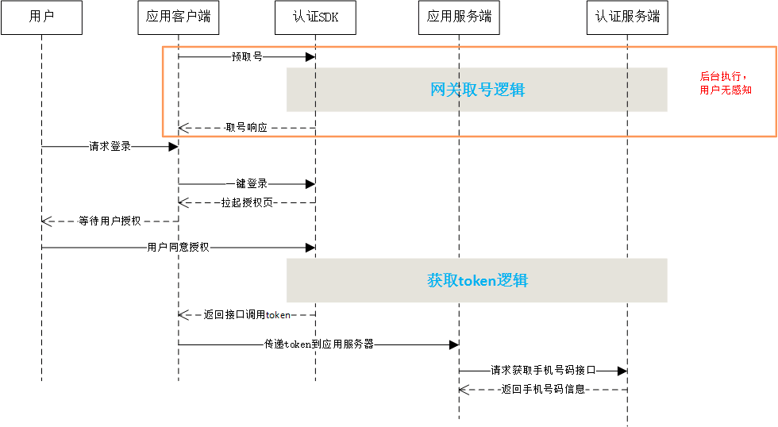
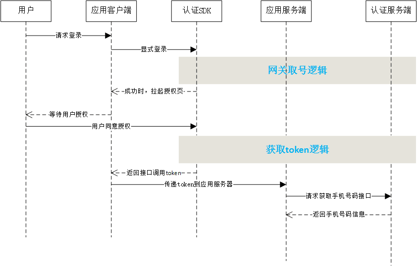
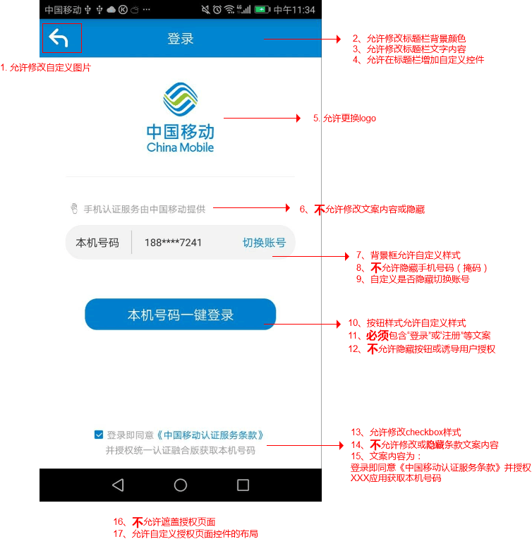

# 1. 开发环境配置
sdk技术问题沟通QQ群：609994083</br>

**注意事项：**

1. 目前SDK支持中国移动2/3/4G、中国电信4G的取号能力，中国联通的取号能力暂未开放。
2. 由于运营商取号能力是通过数据网关实现，取号过程必须在数据流量打开的情况下才能进行（WiFi和数据流量同时打开时，SDK会强制切换到数据流量执行取号逻辑，将会消耗用户少量流量），当信号弱或者网络有干扰时，时延会高于平均值，取号成功率较低。
3. 本SDK同时提供一键登录和本机号码校验功能，开发者根据实际的需求调用对应方法和接口。
4. 对于双卡手机，移动认证SDK只对当前的流量卡取号，如果用户需要使用第二张卡登录，建议开发者在授权登录页面上增加其他登录方式。

## 1.1. 接入流程

**1.申请appid和appkey**

根据《开发者接入流程文档》，前往中国移动开发者社区（dev.10086.cn)，按照文档要求创建开发者账号并申请appid和appkey，并填写应用的包名和包签名。

**2.申请能力**

应用创建完成后，在能力配置页面上，勾选应用需要接入的能力类型，如一键登录，并配置应用的服务器出口IP地址。（如果在服务端需要用非对称加密方法对一些重要信息进行加密处理，请在能力配置页面填写RSA加密的公钥）

## 1.2. 开发流程

**第一步：下载SDK及相关文档**

请在开发者群或官网下载最新的SDK包

**第二步：搭建开发环境**

jar包集成方式：

1. 在Eclipse/AS中建立你的工程。 
2. 将`*.jar`拷贝到工程的libs目录下，如没有该目录，可新建。
3. 将sdk所需要的证书文件`clientCert.crt`、`serverPublicKey.pem`从提供的demo工程拷贝到项目`assets`目录下。
4. 将sdk所需要的资源文件（anim, drawable, drawable-xxhdpi, layout, values文件，具体可参考demo工程）从res目录下的文件添加到项目工程中

**第三步：开始使用移动认证SDK**

**[1] AndroidManifest.xml设置**

添加必要的权限支持: 

```java
<uses-permission android:name="android.permission.INTERNET" />
<uses-permission android:name="android.permission.READ_PHONE_STATE" />
<uses-permission android:name="android.permission.ACCESS_WIFI_STATE" />
<uses-permission android:name="android.permission.ACCESS_NETWORK_STATE" />
<uses-permission android:name="android.permission.SEND_SMS" />
<uses-permission android:name="android.permission.CHANGE_NETWORK_STATE" />
<uses-permission android:name="android.permission.WRITE_SETTINGS"/>
```

注意：在调用预取号、显式登录、隐式登录方法时，需提前申请`READ_PHONE_STATE`，否则会报错

**[2] 配置授权登录activity**

开发者根据需要配置横竖屏方向：`android:screenOrientation`
示列代码为`unspecified`（默认值由系统选择显示方向）

```java
<activity
    android:name="com.cmic.sso.sdk.activity.OAuthActivity"
    android:configChanges="orientation|keyboardHidden|screenSize"
    android:screenOrientation="unspecified"
    android:launchMode="singleTop">
</activity>
<!-- required -->
<activity
    android:name="com.cmic.sso.sdk.activity.BufferActivity"
    android:configChanges="orientation|keyboardHidden|screenSize"
    android:screenOrientation="unspecified"
    android:launchMode="singleTop">
</activity>
<!-- required -->
<activity
    android:name="com.cmic.sso.sdk.activity.LoginAuthActivity"
    android:configChanges="orientation|keyboardHidden|screenSize"
    android:screenOrientation="unspecified"
    android:launchMode="singleTop">
</activity>
```

通过以上两个步骤，工程就已经配置完成了。接下来就可以在代码里使用统一认证的SDK进行开发了

**[3] 创建一个AuthnHelper实例。**

`AuthnHelper`是SDK的功能入口，所有的接口调用都得通过AuthnHelper进行调用。因此，调用SDK，首先需要创建一个AuthnHelper实例

**示例代码：**

```java
public void onCreate(Bundle savedInstanceState) {
    super.onCreate(savedInstanceState);
    mContext = this;    
    ……
    mAuthnHelper = AuthnHelper.getInstance(mContext);
    }
```

**方法原型：**

```java
public static AuthnHelper getInstance(Context context)
```

**参数说明：**

| 参数    | 类型    | 说明                                               |
| ------- | ------- | -------------------------------------------------- |
| context | Context | 调用者的上下文环境，其中activity中this即可以代表。 |

**[4] 实现回调。**

所有的SDK接口调用，都会传入一个回调，用于接收SDK返回的调用结果。结果以`JsonObject`的形式传递，`TokenListener`的实现示例代码如下：

```java
mListener = new TokenListener() {
    @Override
    public void onGetTokenComplete(JSONObject jObj) {
        if (jObj != null) {
            mResultString = jObj.toString();
            mHandler.sendEmptyMessage(RESULT);
            if (jObj.has("token")) {
                mtoken = jObj.optString("token");
            }
        }
    }
};
```

<div STYLE="page-break-after: always;"></div>

# 2. 一键登录功能

## 2.1. 准备工作

在接入一键登录功能之前，开发者必须先按照1.1接入流程，在中国移动开发者社区注册开发者账号，创建一个包含移动认证能力的应用，获取响应的AppId和AppKey，并且在开发者社区中勾选一键登录能力，配置应用服务器出口ip地址。

## 2.2. 流程说明

移动认证一键登录允许开发者在用户同意授权后，在客户端侧获取`接口调用凭证`（token），第三方服务器携带token调用`获取手机号码接口`，实现获取当前授权登录用户的手机号码等信息。

根据开发者是否提前调用预取号，可以用2种调用逻辑：

提前预取号时：

1. 开发者调用预取号方法，预取号成功将会返回当前用户取号状态是否成功。
2. 开发者调用一键登录方法，SDK将拉起授权页；
3. 用户同意应用获取本机号码，成功时，SDK将返回接口调用凭证token；
4. 携带token进行接口调用，获取用户的手机号码信息。

整体流程：



未提前预取号时：

1. 开发者调用显式登录方法，等待取号结果，如果取号成功，SDK将拉起授权页activity；
2. 用户同意应用获取本机号码，成功时，SDK将返回接口调用凭证token；
3. 携带token进行接口调用，获取用户的手机号码信息。

整体流程：



## 2.3. 预取号（非必选）

由于移动认证网关取号受用户当前的使用网络状态影响，对于未开启数据网络、弱信号等终端，一键登录网关取号很有可能会失败，因此，移动认证提供预取号方法，在使用一键登录之前，在用户无感知的情况下，调用本方法，提前预知用户当前网络状态是否可实现一键登录，并暂时缓存一个临时取号凭证在应用的运行内存中，保证开发者在使用一键登录时，不需要再次执行耗时更长的网关取号流程。

预取号时，需要注意以下几点：

1. 临时取号凭证保存在内存中，应用被杀死后，凭证也会一起消失。凭证消失后，开发者可以再次调用预取号方法刷新当前用户的网络状态，根据预取号结果，再决定是否调用一键登录方法。
2. 凭证如果未因为应用被杀死而消失，其有效期为60分钟。
3. 建议对未登录的用户，在应用开启时或者在用户登录操作前的页面，调用预取号方法。
4. 预取号是非必选调用，开发者可以直接跳过2.3，直接调用2.4的一键登录方法，在一键登录方法中将会实现预取号的逻辑。（取号过程会有时延，用户能感知）
5. 设置取号超时方法适用于预取号。

**请求示例代码**

```java
/***
判断和获取READ_PHONE_STATE权限逻辑
***/   

//创建AuthnHelper实例
public void onCreate(Bundle savedInstanceState) {
    super.onCreate(savedInstanceState);
    mContext = this;    
    ……
    mAuthnHelper = AuthnHelper.getInstance(mContext);
    }

//实现取号回调
mListener = new TokenListener() {
    @Override
    public void onGetTokenComplete(JSONObject jObj) {
        …………	// 应用接收到回调后的处理逻辑
    }
};

//调用取号方法
mAuthnHelper.umcLoginPre(APP_ID, APP_KEY, mListener);
```

**预取号方法原型**

```java
public void umcLoginPre(final String appId, 
            final String appKey,
            final TokenListener listener)
```

**参数说明：**

| 参数     | 类型          | 说明                                                         |
| :------- | :------------ | :----------------------------------------------------------- |
| appId    | String        | 应用的AppID                                                  |
| appkey   | String        | 应用密钥                                                     |
| listener | TokenListener | TokenListener为回调监听器，是一个java接口，需要调用者自己实现；TokenListener是接口中的认证登录token回调接口，OnGetTokenComplete是该接口中唯一的抽象方法，即void OnGetTokenComplete(JSONObject  jsonobj) |

**响应参数**

OnGetTokenComplete的参数JSONObject，含义如下：

| 字段       | 类型    | 含义                                                  |
| ---------- | ------- | ----------------------------------------------------- |
| resultCode | Int     | 接口返回码，“103000”为成功。具体返回码见4.1 SDK返回码 |
| desc       | boolean | 成功标识，true为成功。                                |

## 2.4. 一键登录

开发者在用户需要使用到一键登录的场景，调用一键登录方法，SDK将会拉起用户授权页面，用户授权后，SDK将返回取号调用token给应用客户端。

**一键登录逻辑说明**

SDK自动弹出登录缓冲界面（图一，<font  style="color:blue; font-style:italic;">预取号成功将不会弹出缓冲页</font>），若取号成功，自动切换到授权登录页面（图二），用户授权登录后，即可使用本机号码进行登录；若用户获取本机号码失败，自动跳转到短信验证码登录页面（图三，<font  style="color:blue; font-style:italic;">开发者可以选择是否跳到SDK提供的短信验证页面</font>），引导用户使用短信验证码登录。


**请求示例代码**

```java
/***
判断和获取READ_PHONE_STATE权限逻辑
***/   

//创建AuthnHelper实例
public void onCreate(Bundle savedInstanceState) {
    super.onCreate(savedInstanceState);
    mContext = this;    
    ……
    mAuthnHelper = AuthnHelper.getInstance(mContext);
    }

//实现取号回调
mListener = new TokenListener() {
    @Override
    public void onGetTokenComplete(JSONObject jObj) {
        …………	// 应用接收到回调后的处理逻辑
    }
};

//调用一键登录方法
mAuthnHelper.getTokenExp(Constant.APP_ID, Constant.APP_KEY,
                 AuthnHelper.AUTH_TYPE_DYNAMIC_SMS + AuthnHelper.AUTH_TYPE_SMS, 
                 mListener);
```

**一键登录方法原型**

```java
public void getTokenExp(final String appId, 
            final String appKey,
            final String authType, 
            final TokenListener listener)
```

**参数说明**

| 参数      | 类型          | 说明                                                         |
| :-------- | :------------ | :----------------------------------------------------------- |
| appId     | String        | 应用的AppID                                                  |
| appkey    | String        | 应用密钥                                                     |
| loginType | String        | 登录类型，AuthnHelper.UMC_LOGIN_DISPLAY                      |
| authType  | String        | 认证类型，目前支持网关鉴权、短验和短信上行，网关鉴权是默认必选认证类型，短验和短信上行是开发者可选认证:</br>1.短信验证码：AuthnHelper.AUTH_TYPE_DYNAMIC_SMS</br>2.短信上行：AuthnHelper.AUTH_TYPE_SMS</br> 参数为空时，默认只选择网关鉴权方式取号 |
| listener  | TokenListener | TokenListener为回调监听器，是一个java接口，需要调用者自己实现；TokenListener是接口中的认证登录token回调接口，OnGetTokenComplete是该接口中唯一的抽象方法，即void OnGetTokenComplete(JSONObject  jsonobj) |

**`authType`参数说明：**

1. 开发者可单独选择其中一种认证类型，也可以用“+”号组合同时使用三种认证类型，**SDK登录认证优先级顺序为：网关取号 → 短信上行 → 短信验证码**。示例：`AuthnHelper.AUTH_TYPE_SMS + AuthnHelper.AUTH_TYPE_DYNAMIC_SMS`
2. 一键登录（网关取号）失败后，将自动使用短信上行取号能力（如果`authType`参数包含短信上行能力），从网关取号切换到短信上行取号**需要用户发送短信权限**，取得权限后，切换过程无感知
3. 网关取号和短信上行均失败时，将自动跳转到短信验证码页面（如果`authType`参数包含短验能力）
4. 若开发者仅使用网关鉴权（`authType`为null），一键登录失败后，返回相应的错误码
5. 如果开发者需要自定义短验页面，`authType`参数不能包含短信验证码能力；
6. 如果开发者在授权页面布局中未隐藏“切换账号”按钮，用户点击按钮时，仍然会跳转到SDK自带的短验页面，因此，开发者如果完全不想使用SDK自带的短验功能，建议把“切换账号”隐藏。

**响应参数**

OnGetTokenComplete的参数JSONObject，含义如下：

| 字段        | 类型   | 含义                                                         |
| ----------- | ------ | ------------------------------------------------------------ |
| resultCode  | Int    | 接口返回码，“103000”为成功。具体响应码见4.1 SDK返回码        |
| resultDesc  | String | 失败时返回：返回错误码说明                                   |
| authType    | String | 认证类型：</br>0:其他；</br>1:WiFi下网关鉴权；</br>2:网关鉴权；</br>3:短信上行鉴权；</br>7:短信验证码登录 |
| authTypeDec | String | 认证类型描述，对应authType                                   |
| token       | String | 成功时返回：临时凭证，token有效期2min，一次有效；同一用户（手机号）10分钟内获取token且未使用的数量不超过30个 |
| openId      | String | 成功时返回：用户身份唯一标识                                 |

## 2.5. 授权页面设计

为了确保用户在登录过程中将手机号码信息授权给开发者使用的知情权，一键登录需要开发者提供授权页登录页面供用户授权确认。开发者在调用授权登录方法前，必须弹出授权页，明确告知用户当前操作会将用户的本机号码信息传递给应用。

###2.5.1. 页面规范细则

Android授权页面规范：




**注意：开发者不得通过任何技术手段，将授权页面的隐私栏、品牌露出内容隐藏、覆盖，对于接入移动认证SDK并上线的应用，我方会对上线的应用授权页面做审查，如果有出现未按要求设计授权页面，将隐私栏、品牌等UI隐去不可见的设计，我方有权将应用的登录功能下线。**

###2.5.2. 修改授权页布局

开发者可以通过修改SDK中layout文件夹中的布局文件，实现应用个性化的设计。

### 2.5.3. 开发者自定义控件

开发者可以在布局文件`umcsdk_login_authority.xml`、`umcsdk_oauth.xml`、`umcsdk_oauth.xml`中添加控件并添加事件，并为添加的控件绑定事件代码：</br>

```java
private RegistListener registListener;
registListener = RegistListener.getInstance();
registListener.add("test_tv", new CustomInterface() {
    @Override
    public void onClick(Context context) {
        Toast.makeText(mContext, "this is custom view", Toast.LENGTH_SHORT).show();
    }
});
```

其中`registListener.add("test_tv",new CustomInterface(){})`第一个参数为所添加自定义控件的id，第二个参数为这个控件所要绑定的事件。注：此Context为applicationContext。

**PS:授权页面关闭配置：** 

在授权页umcsdk_login_authority.xml中添加自定义控件，id命名为umcskd_authority_finish。 

```java
<TextView
android:id="@+id/umcskd_authority_finish"
android:layout_width="wrap_content"
android:layout_height="wrap_content"
android:text="关闭页面"
android:textColor="#0080cc"
android:textSize="30sp"/>
```

通过注册自定义控件的方式添加事件，执行完操作之后如下例子中toast "finish"之后授权页会自动关闭。 

```java
private RegistListener registListener;
registListener = RegistListener.getInstance();
registListener.add("umcskd_authority_finish", new CustomInterface() {
@Override
public void onClick(Context context) {
Toast.makeText(mContext, "finish", Toast.LENGTH_SHORT).show();
}
});
```

## 2.6. 获取手机号码（服务端）

开发者获取token后，需要将token传递到应用服务器，由应用服务器发起获取用户手机号接口的调用。

调用本接口，必须保证：

1. token在有效期内。（2分钟）
2. token还未使用过。
3. 应用服务器出口IP地址在开发者社区中配置正确。
4. 如果使用RSA加密，确保应用的公钥在开发者社区正确填写。

**接口说明：**

请求地址：https://www.cmpassport.com/unisdk/rsapi/loginTokenValidate

协议： HTTPS 

请求方法： POST+json,Content-type设置为application/json

**请求示例代码：**

```
{
    appid = 10000001;
    msgid = 34a5588136d6404784831609cdcdc633;
    sign = 2240b9213b9b8dccfe7f6257a21071cf;
    strictcheck = 0;
    systemtime = 20180529112443243;
    token = STsid00000015275642798949tUyg6KsmyEWKk005bCfuxUmCXeqeFRK;
    version = "2.0";
}

```

**参数说明**

| 参数                | 约束 | 说明                                                         |
| :------------------ | :--: | :----------------------------------------------------------- |
| version             | 必选 | 填2.0                                                        |
| msgid               | 必选 | 标识请求的随机数即可(1-36位)                                 |
| systemtime          | 必选 | 请求消息发送的系统时间，精确到毫秒，共17位，格式：20121227180001165 |
| strictcheck         | 必选 | 暂时填写"0"                                                  |
| appid               | 必选 | 业务在统一认证申请的应用id                                   |
| expandparams        | 可选 | 扩展参数                                                     |
| token               | 必选 | 需要解析的凭证值。                                           |
| sign                | 必选 | 当**encryptionalgorithm≠"RSA"**时，sign = MD5（appid + version + msgid + systemtime + strictcheck + token + appkey)（注：“+”号为合并意思，不包含在被加密的字符串中），输出32位大写字母；</br>当**encryptionalgorithm="RSA"**，业务端RSA私钥签名（appid+token）, 服务端使用业务端提供的公钥验证签名（公钥可以在开发者社区配置）。 |
| encryptionalgorithm | 可选 | 推荐使用。开发者如果需要使用非对称加密算法时，填写“RSA”。（当该值不设置为“RSA”时，执行MD5签名校验） |

**返回说明**

| 参数         | 类型   | 说明                                                         |
| ------------ | ------ | ------------------------------------------------------------ |
| inresponseto | string | 对应的请求消息中的msgid                                      |
| systemtime   | string | 响应消息发送的系统时间，精确到毫秒，共17位，格式：20121227180001165 |
| resultcode   | string | 返回码                                                       |
| msisdn       | string | 表示手机号码，如果加密方式为RSA，应用需要用私钥进行解密      |

<div STYLE="page-break-after: always;"></div>

# 3. 本机号码校验

## 3.1. 准备工作

在接入本机号码校验功能之前，开发者必须先按照1.1 接入流程，在中国移动开发者社区注册开发者账号，创建一个包含移动认证能力的应用，获取响应的AppId和AppKey。并且在开发者社区中勾选本机号码校验能力，配置应用服务器出口ip地址。

## 3.2. 流程说明

移动认证本机号码校验用于校验用户当前输入的手机号码是否为本机号码。

整体流程为：

1. 开发者调用预取号方法，预取号成功将会返回当前用户取号状态是否成功。（非必选）
2. 调用本机号码校验方法，获取用于做本机号码校验的接口调用凭证（token）
3. 携带token和手机号码信息进行接口调用，获取手机号码校验结果。

本机号码校验整体流程：


## 3.3. 预取号（非必选）

由于移动认证网关取号受用户当前的使用网络状态影响，对于未开启数据网络、弱信号等终端，本机号码校验网关取号很有可能会失败，因此，移动认证提供预取号方法，在使用本机号码校验之前，在用户无感知的情况下，调用本方法，提前预知用户当前网络状态是否可实现本机号码校验，并暂时缓存一个临时取号凭证在应用的运行内存中，保证开发者在使用本机号码校验时，不需要再次执行耗时更长的网关取号流程。

预取号时，需要注意以下几点：

1. 临时取号凭证保存在内存中，应用被杀死后，凭证也会一起消失。凭证消失后，开发者可以再次调用预取号方法刷新当前用户的网络状态，根据预取号结果，再决定是否调用本机号码校验方法。
2. 凭证如果未因为应用被杀死而消失，其有效期为60分钟。
3. 建议对未登录的用户，在应用开启时或者在用户登录操作前的页面，调用预取号方法。
4. 预取号是非必选调用，开发者可以直接跳过3.3，直接调用3.4的本机号码校验方法，在本机号码校验方法中将会实现预取号的逻辑。（取号过程会有时延，用户能感知）
5. 设置取号超时方法适用于预取号。

**请求示例代码**

```java
/***
判断和获取READ_PHONE_STATE权限逻辑
***/   

//创建AuthnHelper实例
public void onCreate(Bundle savedInstanceState) {
    super.onCreate(savedInstanceState);
    mContext = this;    
    ……
    mAuthnHelper = AuthnHelper.getInstance(mContext);
    }

//实现取号回调
mListener = new TokenListener() {
    @Override
    public void onGetTokenComplete(JSONObject jObj) {
        …………	// 应用接收到回调后的处理逻辑
    }
};

//调用取号方法
mAuthnHelper.umcLoginPre(APP_ID, APP_KEY, mListener);
```

**预取号方法原型**

```java
public void umcLoginPre(final String appId, 
            final String appKey,
            final TokenListener listener)
```

**参数说明：**

| 参数     | 类型          | 说明                                                         |
| :------- | :------------ | :----------------------------------------------------------- |
| appId    | String        | 应用的AppID                                                  |
| appkey   | String        | 应用密钥                                                     |
| listener | TokenListener | TokenListener为回调监听器，是一个java接口，需要调用者自己实现；TokenListener是接口中的认证登录token回调接口，OnGetTokenComplete是该接口中唯一的抽象方法，即void OnGetTokenComplete(JSONObject  jsonobj) |

**响应参数**

OnGetTokenComplete的参数JSONObject，含义如下：

| 字段       | 类型    | 含义                                                  |
| ---------- | ------- | ----------------------------------------------------- |
| resultCode | Int     | 接口返回码，“103000”为成功。具体返回码见4.1 SDK返回码 |
| desc       | boolean | 成功标识，true为成功。                                |

## 3.4. 获取号码校验token

开发者可以在应用内部任意页面调用本方法，获取本机号码校验的接口调用凭证（token）

**请求示例代码**

```java
/***
判断和获取READ_PHONE_STATE权限逻辑
***/   

//创建AuthnHelper实例
public void onCreate(Bundle savedInstanceState) {
    super.onCreate(savedInstanceState);
    mContext = this;    
    ……
    mAuthnHelper = AuthnHelper.getInstance(mContext);
    }

//实现校验回调
mListener = new TokenListener() {
    @Override
    public void onGetTokenComplete(JSONObject jObj) {
        …………	// 应用接收到回调后的处理逻辑
    }
};

//调用本机号码校验方法
mAuthnHelper.getTokenImp(APP_ID, APP_KEY, mListener);
```

**本机号码校验方法原型**

```java
public void getTokenImp(final String appId, 
            final String appKey,
            final TokenListener listener)
```

**参数说明**

| 参数     | 类型          | 说明                                                         |
| :------- | :------------ | :----------------------------------------------------------- |
| appId    | String        | 应用的AppID                                                  |
| appkey   | String        | 应用密钥                                                     |
| listener | TokenListener | TokenListener为回调监听器，是一个java接口，需要调用者自己实现；TokenListener是接口中的认证登录token回调接口，OnGetTokenComplete是该接口中唯一的抽象方法，即void OnGetTokenComplete(JSONObject  jsonobj) |

**响应参数**

OnGetTokenComplete的参数JSONObject，含义如下：

| 字段        | 类型   | 含义                                                         |
| ----------- | ------ | ------------------------------------------------------------ |
| resultCode  | Int    | 接口返回码，“103000”为成功。具体响应码见4.1 SDK返回码        |
| authType    | Int    | 登录类型。                                                   |
| authTypeDes | String | 登录类型中文描述。                                           |
| openId      | String | 用户身份唯一标识（参数需在开放平台勾选相关能力后开放，如果勾选了一键登录能力，使用本方法时，不返回OpenID） |
| token       | String | 成功返回:临时凭证，token有效期2min，一次有效，同一用户（手机号）10分钟内获取token且未使用的数量不超过30个 |

## 3.5. 本机号码校验（服务端）

开发者获取token后，需要将token传递到应用服务器，由应用服务器发起本机号码校验接口的调用。

调用本接口，必须保证：

1. token在有效期内（2分钟）。
2. token还未使用过。
3. 应用服务器出口IP地址在开发者社区中配置正确。

对于本机号码校验，需要注意：

1. 本产品属于收费业务，开发者未签订服务合同前，每天总调用次数有限，详情可咨询商务。
2. 签订合同后，将不在提供每天免费的测试次数。

**接口说明：**

请求地址： https://www.cmpassport.com/openapi/rs/tokenValidate

协议： HTTPS

请求方法： POST+json,Content-type设置为application/json

**请求示例代码：**

```
{
    body =     {
        openType = 1;
        phoneNum =0A2050AC434A32DE684745C829B3DE570590683FAA1C9374016EF60390E6CE76;
        requesterType = 0;
        sign = 87FCAC97BCF4B0B0D741FE1A85E4DF9603FD301CB3D7100BFB5763CCF61A1488;
        token = STsid0000001517194515125yghlPllAetv4YXx0v6vW2grV1v0votvD;
    };
    header =     {
        appId = 3000******76;
        msgId = f11585580266414fbde9f755451fb7a7;
        timestamp = 20180129105523519;
        version = "1.0";
    };
}
```

**参数说明：**

| 参数          | 层级  | 约束                         | 说明                                                         |
| ------------- | ----- | ---------------------------- | ------------------------------------------------------------ |
| **header**    | **1** | 必选                         |                                                              |
| version       | 2     | 必选                         | 版本号,初始版本号1.0,有升级后续调整                          |
| msgId         | 2     | 必选                         | 使用UUID标识请求的唯一性                                     |
| timestamp     | 2     | 必选                         | 请求消息发送的系统时间，精确到毫秒，共17位，格式：20121227180001165 |
| appId         | 2     | 必选                         | 应用ID                                                       |
| **body**      | **1** | 必选                         |                                                              |
| openType      | 2     | 否，requestertype字段为0时是 | 运营商类型：</br>1:移动;</br>2:联通;</br>3:电信;</br>0:未知  |
| requesterType | 2     | 是                           | 请求方类型：</br>0:APP；</br>1:WAP                           |
| message       | 2     | 否                           | 接入方预留参数，该参数会透传给通知接口，此参数需urlencode编码 |
| expandParams  | 2     | 否                           | 扩展参数格式：param1=value1\|param2=value2  方式传递，参数以竖线 \| 间隔方式传递，此参数需urlencode编码。 |
| phoneNum      | 2     | 是                           | 待校验的手机号码的64位sha256值，字母大写。（手机号码 + appKey + timestamp， “+”号为合并意思）（注：建议开发者对用户输入的手机号码的格式进行校验，增加校验通过的概率） |
| token         | 2     | 是                           | 身份标识，字符串形式的token                                  |
| sign          | 2     | 是                           | 签名，HMACSHA256( appId +     msgId + phonNum + timestamp + token + version)，输出64位大写字母 （注：“+”号为合并意思，不包含在被加密的字符串中,appkey为秘钥, 参数名做自然排序（Java是用TreeMap进行的自然排序）） |

**返回说明：**

| 参数         | 层级  | 类型   | 说明                                                         |
| ------------ | ----- | :----- | :----------------------------------------------------------- |
| **header**   | **1** |        |                                                              |
| msgId        | 2     | string | 对应的请求消息中的msgid                                      |
| timestamp    | 2     | string | 响应消息发送的系统时间，精确到毫秒，共17位，格式：20121227180001165 |
| appId        | 2     | string | 应用ID                                                       |
| resultCode   | 2     | string | 平台返回码                                                   |
| **body**     | **1** |        |                                                              |
| resultDesc   | 2     | String | 平台返回码                                                   |
| message      | 2     | String | 接入方预留参数，该参数会透传给通知接口，此参数需urlencode编码 |
| expandParams | 2     | String | 扩展参数格式：param1=value1\|param2=value2  方式传递，参数以竖线 \| 间隔方式传递，此参数需urlencode编码。 |

<div STYLE="page-break-after: always;"></div>

# 4. SDK方法说明

## 4.1. 获取管理类的实例对象

### 4.1.1. 方法描述

获取管理类的实例对象

**原型**

```java
public AuthnHelper (Context context)
```

### 4.1.2. 参数说明

| 参数      | 类型      | 说明                              |
| ------- | ------- | ------------------------------- |
| context | Context | 调用者的上下文环境，其中activity中this即可以代表。 |

## 4.2. 预取号

### 4.2.1. 方法描述

**功能**

由于移动认证网关取号受用户当前的使用网络状态影响，对于未开启数据网络、弱信号等终端，一键登录网关取号很有可能会失败，因此，移动认证提供预取号方法，在使用一键登录之前，在用户无感知的情况下，调用本方法，提前预知用户当前网络状态是否可实现一键登录，并暂时缓存一个临时取号凭证在应用的运行内存中，保证开发者在使用一键登录时，不需要再次执行耗时更长的网关取号流程。

**注意：预取号前，开发者需提前申请`READ_PHONE_STATE`权限，否则预取号会失败！**

**原型**

```java
public void umcLoginPre(final String appId, 
            final String appKey,
            final TokenListener listener)
```

### 4.2.2. 参数说明

**请求参数**

| 参数       | 类型            | 说明                                       |
| :------- | :------------ | :--------------------------------------- |
| appId    | String        | 应用的AppID                                 |
| appkey   | String        | 应用密钥                                     |
| listener | TokenListener | TokenListener为回调监听器，是一个java接口，需要调用者自己实现；TokenListener是接口中的认证登录token回调接口，OnGetTokenComplete是该接口中唯一的抽象方法，即void OnGetTokenComplete(JSONObject  jsonobj) |

**响应参数**

OnGetTokenComplete的参数JSONObject，含义如下：

| 字段         | 类型      | 含义                                 |
| ---------- | ------- | ---------------------------------- |
| resultCode | Int     | 接口返回码，“103000”为成功。具体返回码见4.1 SDK返回码 |
| desc       | boolean | 成功标识，true为成功。                      |

### 4.2.3. 示例

**请求示例代码**

```java
mAuthnHelper.umcLoginPre(Constant.APP_ID, 
        Constant.APP_KEY,
        mListener);
```

**响应示例代码**

```
{
    "resultCode": "103000",
    "desc": "true",
}
```

## 4.3. 一键登录

### 4.3.1. 方法描述

开发者在用户需要使用到一键登录的场景，调用一键登录方法，SDK将会拉起用户授权页面，用户授权后，SDK将返回取号调用token给应用客户端。

**原型**

```java
public void getTokenExp(final String appId, 
            final String appKey,
            final String authType, 
            final TokenListener listener)
```

### 4.3.2. 参数说明

**请求参数**

| 参数        | 类型            | 说明                                       |
| :-------- | :------------ | :--------------------------------------- |
| appId     | String        | 应用的AppID                                 |
| appkey    | String        | 应用密钥                                     |
| loginType | String        | 登录类型，AuthnHelper.UMC_LOGIN_DISPLAY       |
| authType  | String        | 认证类型，目前支持网关鉴权、短验和短信上行，网关鉴权是默认必选认证类型，短验和短信上行是开发者可选认证:</br>1.短信验证码：AuthnHelper.AUTH_TYPE_DYNAMIC_SMS</br>2.短信上行：AuthnHelper.AUTH_TYPE_SMS</br> 参数为空时，默认只选择网关鉴权方式取号 |
| listener  | TokenListener | TokenListener为回调监听器，是一个java接口，需要调用者自己实现；TokenListener是接口中的认证登录token回调接口，OnGetTokenComplete是该接口中唯一的抽象方法，即void OnGetTokenComplete(JSONObject  jsonobj) |

**`authType`参数说明：**

1. 开发者可单独选择其中一种认证类型，也可以用“+”号组合同时使用三种认证类型，**SDK登录认证优先级顺序为：网关取号 → 短信上行 → 短信验证码**。示例：`AuthnHelper.AUTH_TYPE_SMS + AuthnHelper.AUTH_TYPE_DYNAMIC_SMS`
2. 一键登录（网关取号）失败后，将自动使用短信上行取号能力（如果`authType`参数包含短信上行能力），从网关取号切换到短信上行取号**需要用户发送短信权限**，取得权限后，切换过程无感知
3. 网关取号和短信上行均失败时，将自动跳转到短信验证码页面（如果`authType`参数包含短验能力）
4. 若开发者仅使用网关鉴权（`authType`为null），一键登录失败后，返回相应的错误码
5. 如果开发者需要自定义短验页面，`authType`参数不能包含短信验证码能力；
6. 如果开发者在授权页面布局中未隐藏“切换账号”按钮，用户点击按钮时，仍然会跳转到SDK自带的短验页面，因此，开发者如果完全不想使用SDK自带的短验功能，建议把“切换账号”隐藏。

**响应参数**

OnGetTokenComplete的参数JSONObject，含义如下：

| 字段          | 类型     | 含义                                       |
| ----------- | ------ | ---------------------------------------- |
| resultCode  | Int    | 接口返回码，“103000”为成功。具体响应码见4.1 SDK返回码       |
| resultDesc  | String | 失败时返回：返回错误码说明                            |
| authType    | String | 认证类型：0:其他；</br>1:WiFi下网关鉴权；</br>2:网关鉴权；</br>3:短信上行鉴权；</br>7:短信验证码登录 |
| authTypeDec | String | 认证类型描述，对应authType                        |
| token       | String | 成功时返回：临时凭证，token有效期2min，一次有效；同一用户（手机号）10分钟内获取token且未使用的数量不超过30个 |
| openId      | String | 成功时返回：用户身份唯一标识                           |

### 2.3.3. 示例

**请求示例代码**

```java
mAuthnHelper.getTokenExp(Constant.APP_ID, Constant.APP_KEY,
                 AuthnHelper.AUTH_TYPE_DYNAMIC_SMS + AuthnHelper.AUTH_TYPE_SMS, 
                 mListener);
```

**响应示例代码**

```
{
    "authType": "网关鉴权",
    "resultCode": "103000",
    "openId": "9M7RaoZH1DUrJ15ZjJkctppraYpoNKQW9xKtQrcmCGTFONUKeT3w",
    "token": "848401000133020037515451304E7A497A4D7A5A4651554A474E6A41784D304E4640687474703A2F2F3231312E3133362E31302E3133313A383038302F403031030004051C7840040012383030313230313730373230313030303137050010694969C667EA4D248DFA125D7C4BD35BFF00207EF179935851E1578B313B366007126A3FD3667BCD2B812EC2D084B8924E7164"
}
```

## 4.4. 本机号码校验

### 4.4.1. 方法描述

用于获取本机号码校验接口调用token

**注意：调用本方法前前，开发者需提前申请`READ_PHONE_STATE`权限，否则会失败！**

**原型**

```java
public void getTokenImp(final String appId, 
            final String appKey,
            final TokenListener listener)
```

### 4.4.2. 参数说明

**请求参数**

| 参数       | 类型            | 说明                                       |
| :------- | :------------ | :--------------------------------------- |
| appId    | String        | 应用的AppID                                 |
| appkey   | String        | 应用密钥                                     |
| listener | TokenListener | TokenListener为回调监听器，是一个java接口，需要调用者自己实现；TokenListener是接口中的认证登录token回调接口，OnGetTokenComplete是该接口中唯一的抽象方法，即void OnGetTokenComplete(JSONObject  jsonobj) |

**响应参数**

OnGetTokenComplete的参数JSONObject，含义如下：

| 字段          | 类型     | 含义                                       |
| ----------- | ------ | ---------------------------------------- |
| resultCode  | Int    | 接口返回码，“103000”为成功。具体响应码见4.1 SDK返回码       |
| authType    | Int    | 登录类型。                                    |
| authTypeDes | String | 登录类型中文描述。                                |
| openId      | String | 用户身份唯一标识（参数需在开放平台勾选相关能力后开放，如果勾选了一键登录能力，使用本方法时，不返回OpenID） |
| token       | String | 成功返回:临时凭证，token有效期2min，一次有效，同一用户（手机号）10分钟内获取token且未使用的数量不超过30个 |

### 4.4.3. 示例

**请求示例代码**

```java
mAuthnHelper.getTokenImp(Constant.APP_ID, Constant.APP_KEY,mListener);
```

**响应示例代码**

```
{
    "resultCode": "103000",
    "authType": "2",
    "authTypeDes": "网关鉴权",
    "openId": "003JI1Jg1rmApSg6yG0ydUgLWZ4Bnx0rb4wtWLtyDRc0WAWoAUmE",
    "token": "STsid0000001512438403572hQSEygBwiYc9fIw0vExdI4X3GMkI5UVw",
}
```

## 4.5. 设置取号超时

###2.5.1. 方法描述

设置取号超时时间，默认为8秒，应用在预取号、一键登录、本机号码校验（SDK方法）阶段时，如果需要更改超时时间，可使用该方法配置。

**原型**

```java
public void setTimeOut(int timeOut)
```

###2.5.2. 参数说明

**请求参数**

| 参数    | 类型 | 说明                       |
| ------- | ---- | -------------------------- |
| timeOut | int  | 设置超时时间（单位：毫秒） |

**响应参数**

无

<div STYLE="page-break-after: always;"></div>

# 5. 服务端接口说明

## 5.1. 获取手机号码接口

业务平台或服务端携带用户授权成功后的token来调用认证服务端获取用户手机号码等信息。

### 5.1.1. 接口说明

**请求地址：**https://www.cmpassport.com/unisdk/rsapi/loginTokenValidate

**协议：** HTTPS 

**请求方法：** POST+json,Content-type设置为application/json

**注意：开发者需到开发者社区填写服务端出口IP地址后才能正常使用**

### 5.1.2. 参数说明

**请求参数**

| 参数                |  类型  | 约束 | 说明                                                         |
| :------------------ | :----: | :--: | :----------------------------------------------------------- |
| version             | string | 必选 | 填2.0                                                        |
| msgid               | string | 必选 | 标识请求的随机数即可(1-36位)                                 |
| systemtime          | string | 必选 | 请求消息发送的系统时间，精确到毫秒，共17位，格式：20121227180001165 |
| strictcheck         | string | 必选 | 暂时填写"0"                                                  |
| appid               | string | 必选 | 业务在统一认证申请的应用id                                   |
| expandparams        | string | 可选 | 扩展参数                                                     |
| token               | string | 必选 | 需要解析的凭证值。                                           |
| sign                | string | 必选 | 当**encryptionalgorithm≠"RSA"**时，sign = MD5（appid + version + msgid + systemtime + strictcheck + token + appkey)（注：“+”号为合并意思，不包含在被加密的字符串中），输出32位大写字母；</br>当**encryptionalgorithm="RSA"**，业务端RSA私钥签名（appid+token）, 服务端使用业务端提供的公钥验证签名（公钥可以在开发者社区配置）。 |
| encryptionalgorithm | string | 可选 | 开发者如果需要使用非对称加密算法时，填写“RSA”。（当该值不设置为“RSA”时，执行MD5签名校验） |

**响应参数**

| 参数         | 类型   | 约束 | 说明                                                         |
| ------------ | ------ | ---- | ------------------------------------------------------------ |
| inresponseto | string | 必选 | 对应的请求消息中的msgid                                      |
| systemtime   | string | 必选 | 响应消息发送的系统时间，精确到毫秒，共17位，格式：20121227180001165 |
| resultcode   | string | 必选 | 返回码                                                       |
| msisdn       | string | 必选 | 表示手机号码，如果加密方式为RSA，应用需要用私钥进行解密      |

### 5.1.3. 示例

**请求示例**

```
{
    appid = 3000******76; 
    msgid = 335e06a28f064b999d6a25e403991e4c;
    sign = 213EF8D0CC71548945A83166575DFA68;
    strictcheck = 0;
    systemtime = 20180129112955435;
    token = STsid0000001517196594066OHmZvPMBwn2MkFxwvWkV12JixwuZuyDU;
    version = "2.0";
}
```

**响应示例**

```
{
    inresponseto = 335e06a28f064b999d6a25e403991e4c;
    msisdn = 14700000000;
    resultCode = 103000;
    systemtime = 20180129112955477;
}
```

## 5.2. 本机号码校验接口

校验用户输入的号码是否本机号码。
应用将手机号码传给移动认证SDK，移动认证SDK向认证服务端发起本机号码校验请求，认证服务端通过网关获取本机手机号码和第三方应用传输的手机号码进行校验，返回校验结果。

### 5.2.1. 接口说明

**调用次数说明：**本产品属于收费业务，开发者未签订服务合同前，每天总调用次数有限，详情可咨询商务。

**请求地址：** https://www.cmpassport.com/openapi/rs/tokenValidate

**协议：** HTTPS

**请求方法：** POST+json,Content-type设置为application/json

**回调地址：**请参考开发者接入流程文档

### 5.2.2.  参数说明

**请求参数**

| 参数          | 类型   | 层级  | 约束                         | 说明                                                         |
| ------------- | ------ | ----- | ---------------------------- | ------------------------------------------------------------ |
| **header**    |        | **1** | 必选                         |                                                              |
| version       | string | 2     | 必选                         | 版本号,初始版本号1.0,有升级后续调整                          |
| msgId         | string | 2     | 必选                         | 使用UUID标识请求的唯一性                                     |
| timestamp     | string | 2     | 必选                         | 请求消息发送的系统时间，精确到毫秒，共17位，格式：20121227180001165 |
| appId         | string | 2     | 必选                         | 应用ID                                                       |
| **body**      |        | **1** | 必选                         |                                                              |
| openType      | String | 2     | 否，requestertype字段为0时是 | 运营商类型：</br>1:移动;</br>2:联通;</br>3:电信;</br>0:未知  |
| requesterType | String | 2     | 是                           | 请求方类型：</br>0:APP；</br>1:WAP                           |
| message       | String | 2     | 否                           | 接入方预留参数，该参数会透传给通知接口，此参数需urlencode编码 |
| expandParams  | String | 2     | 否                           | 扩展参数格式：param1=value1\|param2=value2  方式传递，参数以竖线 \| 间隔方式传递，此参数需urlencode编码。 |
| phoneNum      | String | 2     | 是                           | 待校验的手机号码的64位sha256值，字母大写。（手机号码 + appKey + timestamp， “+”号为合并意思）（注：建议开发者对用户输入的手机号码的格式进行校验，增加校验通过的概率） |
| token         | String | 2     | 是                           | 身份标识，字符串形式的token                                  |
| sign          | String | 2     | 是                           | 签名，HMACSHA256( appId +     msgId + phonNum + timestamp + token + version)，输出64位大写字母 （注：“+”号为合并意思，不包含在被加密的字符串中,appkey为秘钥, 参数名做自然排序（Java是用TreeMap进行的自然排序）） |
|               |        |       |                              |                                                              |

**响应参数**

| 参数         | 层级  | 类型   | 约束 | 说明                                                         |
| ------------ | ----- | :----- | :--- | :----------------------------------------------------------- |
| **header**   | **1** |        | 必选 |                                                              |
| msgId        | 2     | string | 必选 | 对应的请求消息中的msgid                                      |
| timestamp    | 2     | string | 必选 | 响应消息发送的系统时间，精确到毫秒，共17位，格式：20121227180001165 |
| appId        | 2     | string | 必选 | 应用ID                                                       |
| resultCode   | 2     | string | 必选 | 平台返回码                                                   |
| **body**     | **1** |        | 必选 |                                                              |
| resultDesc   | 2     | String | 必选 | 平台返回码                                                   |
| message      | 2     | String | 否   | 接入方预留参数，该参数会透传给通知接口，此参数需urlencode编码 |
| expandParams | 2     | String | 否   | 扩展参数格式：param1=value1\|param2=value2  方式传递，参数以竖线 \| 间隔方式传递，此参数需urlencode编码。 |

### 5.2.3. 示例

**请求示例**

```
{
    body =     {
        openType = 1;
        phoneNum =0A2050AC434A32DE684745C829B3DE570590683FAA1C9374016EF60390E6CE76;
        requesterType = 0;
        sign = 87FCAC97BCF4B0B0D741FE1A85E4DF9603FD301CB3D7100BFB5763CCF61A1488;
        token = STsid0000001517194515125yghlPllAetv4YXx0v6vW2grV1v0votvD;
    };
    header =     {
        appId = 3000******76;
        msgId = f11585580266414fbde9f755451fb7a7;
        timestamp = 20180129105523519;
        version = "1.0";
    };
}
```

**响应示例**

```
{
    body =     {
        message = "";
        resultDesc = "\U662f\U672c\U673a\U53f7\U7801";
    };
    header =     {
        appId = 3000******76;
        msgId = f11585580266414fbde9f755451fb7a7;
        resultCode = 000;
        timestamp = 20180129105523701;
    };
}
```

<div STYLE="page-break-after: always;"></div>

# 6. 返回码说明

## 6.1. SDK返回码

使用SDK时，SDK会在认证结束后将结果回调给开发者，其中结果为JSONObject对象，其中resultCode为结果响应码，103000代表成功，其他为失败。成功时在根据token字段取出身份标识。失败时根据resultCode定位失败原因。

| 返回码 | 返回码描述                                         |
| ------ | -------------------------------------------------- |
| 103000 | 成功                                               |
| 102101 | 无网络                                             |
| 102102 | 网络异常                                           |
| 102103 | 未开启数据网络                                     |
| 102121 | 用户取消登录                                       |
| 102203 | 输入参数错误                                       |
| 102223 | 数据解析异常                                       |
| 102507 | 请求超时                                           |
| 102508 | 数据网络切换失败                                   |
| 200002 | 手机未安装sim卡                                    |
| 200005 | 用户未授权（READ_PHONE_STATE）                     |
| 200006 | 用户未授权（SEND_SMS）                             |
| 200007 | authType仅使用短信验证码认证                       |
| 200008 | 1. authType参数为空；2. authType参数不合法；       |
| 200009 | 应用合法性校验失败（包名包签名未填写正确）         |
| 200010 | 预取号时imsi获取失败或者没有sim卡                  |
| 200012 | 取号失败，跳短信验证码登录                         |
| 200013 | 短信上行发送短信失败（短信上行）                   |
| 200014 | 手机号码格式错误（短验）                           |
| 200015 | 短信验证码格式错误                                 |
| 200016 | 更新KS失败                                         |
| 200017 | 非移动卡不支持短信上行                             |
| 200018 | 不支持网关登录                                     |
| 200019 | 不支持短信验证码登录                               |
| 200020 | 用户取消登录                                       |
| 200021 | 数据解析异常（服务器异常可重新尝试）               |
| 200022 | 无网络状态                                         |
| 200023 | 请求超时                                           |
| 200024 | 数据网络切换失败                                   |
| 200025 | 未知错误一般出现在线程捕获异常，请配合异常打印分析 |
| 200026 | 输入参数错误                                       |
| 200027 | 预取号时未开启数据流量                             |
| 200028 | 网络请求出错（根据日志分析）                       |
| 200029 | 请求出错,上次请求未完成                            |
| 200030 | 没有初始化参数                                     |
| 200031 | 生成token失败                                      |
| 200032 | KS缓存不存在                                       |
| 200033 | 复用中间件获取Token失败                            |
| 200034 | 预取号token失效                                    |
| 200035 | 协商ks失败                                         |
| 200036 | 预取号失败                                         |
| 200037 | 获取不到openid                                     |
| 200038 | 电信重定向失败                                     |
| 200039 | 电信取号接口返回失败                               |
| 200040 | UI资源加载异常                                     |
| 200042 | 授权页弹出异常                                     |

##6.2. 获取用户信息接口返回码

| 返回码 | 返回码描述                                 |
| ------ | ------------------------------------------ |
| 103000 | 成功                                       |
| 103101 | 签名错误                                   |
| 103102 | 包名/包签名/bundle id错误                  |
| 103103 | 用户不存在                                 |
| 103104 | 用户不支持这种登录方式                     |
| 103105 | 密码错误                                   |
| 103106 | 用户名错误                                 |
| 103107 | 已存在相同的随机数                         |
| 103108 | 短信验证码错误                             |
| 103109 | 短信验证码超时                             |
| 103111 | wap  网关IP错误                            |
| 103112 | 错误的请求                                 |
| 103113 | Token内容错误                              |
| 103114 | token验证KS过期                            |
| 103115 | token验证KS不存在                          |
| 103116 | token验证sqn错误                           |
| 103117 | mac异常                                    |
| 103118 | sourceid不存在                             |
| 103119 | appid不存在                                |
| 103120 | clientauth不存在                           |
| 103121 | passid不存在                               |
| 103122 | btid不存在                                 |
| 103123 | redisinfo不存在                            |
| 103124 | ksnaf校验不一致                            |
| 103125 | 手机号格式错误                             |
| 103127 | 证书验证：版本过期                         |
| 103128 | gba:webservice  error                      |
| 103129 | 获取短信验证码的msgtype异常                |
| 103130 | 新密码不能与当前密码相同                   |
| 103131 | 密码过于简单                               |
| 103132 | 用户注册失败                               |
| 103133 | sourceid不合法                             |
| 103134 | wap方式手机号码为空                        |
| 103135 | 昵称非法                                   |
| 103136 | 邮箱非法                                   |
| 103138 | appid已存在                                |
| 103139 | sourceid已存在                             |
| 103200 | 不需要更新ks错误                           |
| 103202 | 缓存用户不存在或者验证短信输入失败次数过多 |
| 103203 | 缓存用户不存在                             |
| 103204 | 缓存随机数不存                             |
| 103205 | 服务器异常                                 |
| 103207 | 发送短信失败                               |
| 103210 | 修改密码失败                               |
| 103211 | 其他错误                                   |
| 103212 | 校验密码失败                               |
| 103213 | 旧密码失败                                 |
| 103214 | 访问缓存或数据库错误                       |
| 103226 | sqn过小或过大                              |
| 103265 | 用户已存在                                 |
| 103270 | 随机校验凭证过期                           |
| 103271 | 随机校验凭证错误                           |
| 103272 | 随机校验凭证不存在                         |
| 103303 | sip  用户未开户（获取应用密码）            |
| 103304 | sip  用户未开户（注销用户）                |
| 103305 | sip  开户用户名错误                        |
| 103306 | sip  用户名不能为空（获取应用密码）        |
| 103307 | sip  用户名不能为空（注销用户）            |
| 103308 | sip  手机号不合法                          |
| 103309 | sip  opertype 为空                         |
| 103310 | sip  sourceid 不存在                       |
| 103311 | sip  sourceid 不合法                       |
| 103312 | sip  btid 不存在                           |
| 103313 | sip  ks 不存在                             |
| 103314 | sip密码变更失败                            |
| 103315 | sip密码推送失败                            |
| 103399 | sip  sys错误                               |
| 103400 | authorization  为空                        |
| 103401 | 签名消息为空                               |
| 103402 | 无效的  authWay                            |
| 103404 | 加密失败                                   |
| 103405 | 保存数据短信手机号为空                     |
| 103406 | 保存数据短信短信内容为空                   |
| 103407 | 此sourceId,  appPackage, sign已注册        |
| 103408 | 此sourceId注册已达上限   99次              |
| 103409 | query  为空                                |
| 103412 | 无效的请求                                 |
| 103413 | 系统异常                                   |
| 103414 | 参数效验异常                               |
| 103505 | 重放攻击                                   |
| 103511 | 源IP不合法                                 |
| 103810 | 校验失败，接口token版本不一致              |
| 103811 | token为空                                  |
| 103899 | aoi  token 其他错误                        |
| 103901 | 短信验证码下发次数已达上限                 |
| 103902 | 凭证校验失败                               |
| 103903 | 调用webservice错误                         |
| 103904 | 配置不存在                                 |
| 103905 | 获取手机号码错误                           |
| 103906 | 平台迁移访问错误  - （访问旧地址）         |
| 103911 | 请求过于频繁                               |
| 103920 | 没有存在的版本更新                         |
| 103921 | 下载时间戳超时                             |
| 103922 | 自动升级文件没找到                         |
| 104001 | APPID和APPKEY已存在                        |
| 104201 | 凭证已失效或不存在                         |
| 104202 | 短信验证失败过多                           |
| 105001 | 联通网关取号失败                           |
| 105002 | 移动网关取号失败                           |
| 105003 | 电信网关取号失败                           |
| 105004 | 短信上行ip检测不合法                       |
| 105005 | 短信上行发送信息为空                       |
| 105006 | 手机号码为空                               |
| 105007 | 手机号码格式错误                           |
| 105008 | 短信内容为空                               |
| 105009 | 解析失败                                   |
| 105010 | phonescript失效或者非法                    |
| 105011 | getPhonescript参数加密的私钥失效或者非法   |
| 105012 | 不支持电信取号                             |
| 105013 | 不支持联通取号                             |
| 105014 | 校验本机号码失败                           |
| 105015 | 校验有数三要素失败                         |
| 105018 | 用户权限不够                               |
| 105019 | 应用未授权                                 |
## 6.3. 本机号码校验接口返回码

本返回码表仅针对`本机号码校验接口`使用

| 返回码    | 说明              |
| ------ | --------------- |
| 000    | 是本机号码（纳入计费次数）   |
| 001    | 非本机号码（纳入计费次数）   |
| 002    | 取号失败            |
| 003    | 调用内部token校验接口失败 |
| 004    | 加密手机号码错误        |
| 102    | 参数无效            |
| 124    | 白名单校验失败         |
| 302    | sign校验失败        |
| 303    | 参数解析错误          |
| 606    | 验证Token失败       |
| 999    | 系统异常            |
| 102315 | 次数已用完           |
